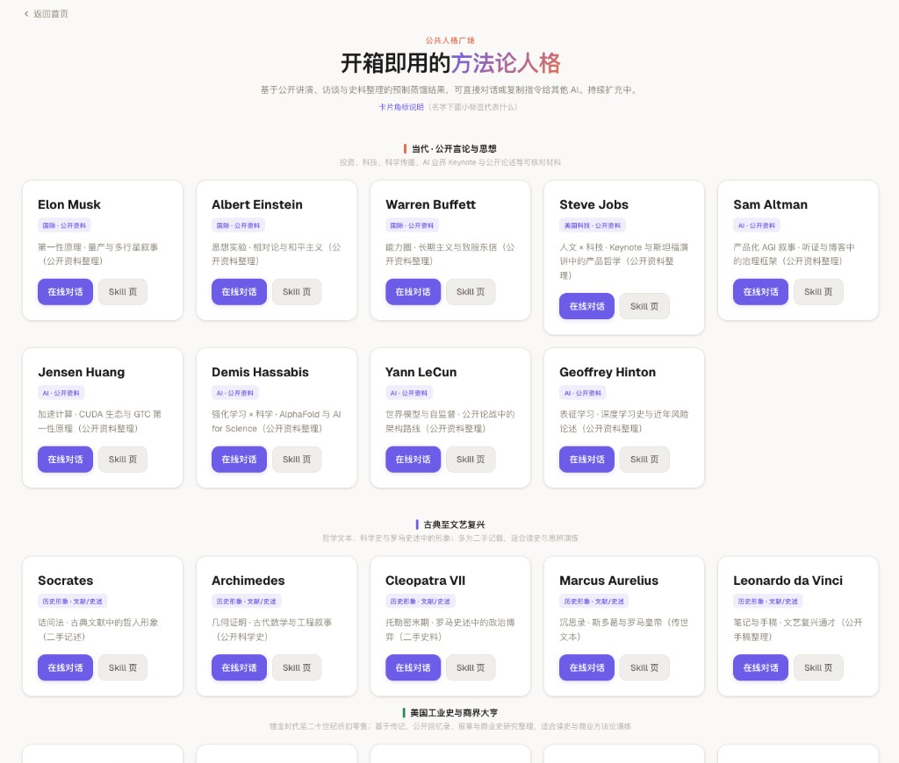

<div align="center">

# 永生.skill

### 与其等着被别人蒸，不如先蒸自己。

### 不蒸馒头争口气！顺便还能蒸馏下身边的人。

[](LICENSE)
[](https://python.org)
[](https://agentskills.io/)
[](https://docs.openclaw.ai/)
[](#谁能被蒸馏)

</div>

<div align="center">

**2026 年了，所有人都在被蒸馏。**

**但凭什么别人来决定你被蒸成什么样？**

</div>

---

<div align="center">

你的同事跑路了？蒸馏他。让他的经验还能接着用。

你的导师退休了？蒸馏他。让「这事你得这么想」还能继续响在你耳边。

你奶奶的唠叨快忘了？蒸馏她。让 AI 替她继续念叨你。

你的朋友不联系了？蒸馏他。你们之间最好笑的对话不该消失。

你前任的语气忘不掉？蒸馏 TA。——算了这个你自己决定。

你自己呢？万一哪天你不在了，谁来当你？

<br/>

**别人蒸馏你之前，先把自己蒸明白。**

</div>

<div align="center">

[谁能被蒸馏？](#谁能被蒸馏) · [蒸什么？](#蒸什么四维蒸馏) · [从哪蒸？](#从哪蒸) · [怎么蒸？](#怎么蒸) · [蒸出来长什么样？](#蒸出来长什么样) · [English](#english)

</div>

---

## 永生数字框架 · 生态全景

> **Star 只点一次，工具箱一次拿齐。**
>
> 仓库根目录的 **[`SKILL.md`](SKILL.md)** 是通用蒸馏引擎。下面三套是独立仓库的扩展 Skill——蒸馏、保护、授权，一条龙。
>
> **给 AI 一键用**：先看 **[`FOR_AI.md`](FOR_AI.md)**（四段可复制指令）。

### 生态仓库一览

| 组件 | 一句话 | 独立仓库 | 本仓入口 |
|------|--------|----------|----------|
| **① 数字永生** | 全网首个开源数字永生框架：四维蒸馏引擎 | 你在这里 | [`SKILL.md`](SKILL.md) |
| **② 蒸笼** | 蒸馏任何人的认知框架当参谋 | [steamer-skill](https://github.com/agenmod/steamer-skill) | [`steamer-skill/`](steamer-skill/) |
| **③ 防蒸馏** | 三层纵深防御，不做数字裸奔 | [distill-shield-skill](https://github.com/agenmod/distill-shield-skill) | [`distill-shield-skill/`](distill-shield-skill/) |
| **④ 蒸馏协议** | 六问分离授权，aka「牛马保护法」 | [distill-protocol-skill](https://github.com/agenmod/distill-protocol-skill) | [`distill-protocol-skill/`](distill-protocol-skill/) |
| **⑤ OKR.skill** | AI 驱动的 OKR 实战框架 | [okr-skill](https://github.com/agenmod/okr-skill) | — |

---

### ① 数字永生 — 全网首个开源数字永生框架

把**任何人**——你自己、同事、导师、亲人、朋友、公众人物——从聊天记录、文档、12+ 平台的数字碎片里，四维结构化蒸馏成 AI 可加载的数字分身。不是往向量库里灌聊天记录，是**真正理解一个人怎么想、怎么说、怎么做决定**。

**入口**：**[`SKILL.md`](SKILL.md)**（主入口）

---

### ② 蒸笼 — 顶流挣了你那么多钱，也该服务你一下了吧

> **独立仓库**：[github.com/agenmod/steamer-skill](https://github.com/agenmod/steamer-skill)

你买了 TA 的书、报了 TA 的课、充了 TA 的会员、看了 TA 几百小时的访谈。**TA 用你出的钱验证了世界怎么运转**——创业者用融资试错，投资人用 LP 的钱下注，讲师把你的学费变成行业实践再卖给下一批人。**这条链条的起点，是你。**

现在，这些被你的钱验证过的认知框架——讲演是公开的、访谈是公开的、博客是公开的——散落在你收藏夹第 200 页吃灰。**蒸笼做的事：把它们结构化提取出来，变成你的 AI 能加载的私人参谋。**

> **这才是认知财富的再分配**：别人用我们给的钱验证过世界怎么运转，作为出资人、消费者、方法论的验证者——大众完全有权运用这些被验证过的认知框架服务自己。不是让真人打工，是让公开知识 7×24 当顾问。**你仍然是拍板的人。**

**入口**：Agent 执行 **[`steamer-skill/SKILL.md`](steamer-skill/SKILL.md)** · 人读故事 **[蒸笼 README](steamer-skill/README.md)** · 独立仓库 **[steamer-skill](https://github.com/agenmod/steamer-skill)**

#### 已蒸馏人格 · [公共人格广场](https://agenworld.com/market)

> 基于公开讲演、访谈与史料整理的 **预制蒸馏结果**，可直接在线对话或复制指令给其他 AI。持续扩充中。
>
> 👉 **[在线体验 · 人格广场](https://agenworld.com/market)**

<div align="center">

</div>

**当代 · 公开言论与思想**

> 投资、科技、科学传播、AI 业界 Keynote 与公开论述等可核对材料

| 人物 | 成功领域 | 蒸馏切面 | 在线体验 |
|------|----------|----------|----------|
| **埃隆·马斯克** | 航天 / 电动车 / 能源 | 第一性原理 · 量产与多行星叙事 | [对话](https://agenworld.com/market) |
| **阿尔伯特·爱因斯坦** | 理论物理 / 科学哲学 | 思想实验 · 相对论与和平主义 | [对话](https://agenworld.com/market) |
| **沃伦·巴菲特** | 价值投资 / 资本配置 | 能力圈 · 长期主义与致股东信 | [对话](https://agenworld.com/market) |
| **史蒂夫·乔布斯** | 消费电子 / 产品设计 | 人文 × 科技 · Keynote 与斯坦福演讲中的产品哲学 | [对话](https://agenworld.com/market) |
| **山姆·奥特曼** | AGI / 创业孵化 | 产品化 AGI 叙事 · 听证与博客中的治理框架 | [对话](https://agenworld.com/market) |
| **黄仁勋** | GPU / 加速计算 | 加速计算 · CUDA 生态与 GTC 第一性原理 | [对话](https://agenworld.com/market) |
| **戴密斯·哈萨比斯** | AI for Science / 深度学习 | 强化学习 × 科学 · AlphaFold 与 AI for Science | [对话](https://agenworld.com/market) |
| **杨立昆** | 计算机视觉 / 自监督学习 | 世界模型与自监督 · 公开论战中的架构路线 | [对话](https://agenworld.com/market) |
| **杰弗里·辛顿** | 深度学习 / 神经网络 | 表征学习 · 深度学习史与近年风险论述 | [对话](https://agenworld.com/market) |

**古典至文艺复兴**

> 哲学文本、科学史与罗马史述中的形象；多为二手记载，适合读史与思辨演练

| 人物 | 成功领域 | 蒸馏切面 | 在线体验 |
|------|----------|----------|----------|
| **苏格拉底** | 哲学 / 辩证法 | 诘问法 · 古典文献中的哲人形象 | [对话](https://agenworld.com/market) |
| **阿基米德** | 数学 / 工程 | 几何证明 · 古代数学与工程叙事 | [对话](https://agenworld.com/market) |
| **克利奥帕特拉七世** | 政治外交 / 帝国博弈 | 托勒密末期 · 罗马史述中的政治博弈 | [对话](https://agenworld.com/market) |
| **马可·奥勒留** | 哲学 / 帝国治理 | 沉思录 · 斯多葛与罗马皇帝 | [对话](https://agenworld.com/market) |
| **列奥纳多·达·芬奇** | 艺术 / 工程 / 科学 | 笔记与手稿 · 文艺复兴通才 | [对话](https://agenworld.com/market) |

**美国工业史与商界大亨**

> 镀金时代至二十世纪折扣零售；基于传记、公开回忆录、报章与商业史研究整理

| 人物 | 成功领域 | 蒸馏切面 | 在线体验 |
|------|----------|----------|----------|
| **科尼利厄斯·范德比尔特** | 铁路 / 航运 | 铁路与航运 · 镀金时代规模与价格战 | [对话](https://agenworld.com/market) |
| **约翰·D·洛克菲勒** | 石油 / 产业整合 | 标准石油 · 整合、成本与慈善的公开叙事 | [对话](https://agenworld.com/market) |
| **安德鲁·卡内基** | 钢铁 / 慈善 | 钢铁王 · 《财富的福音》与公共图书馆 | [对话](https://agenworld.com/market) |
| **亨利·福特** | 汽车制造 / 流水线 | 流水线与 T 型车 · 大众消费主义 | [对话](https://agenworld.com/market) |
| **J·P·摩根** | 金融 / 产业并购 | 金融整合 · 铁路、钢铁与恐慌时期的流动性 | [对话](https://agenworld.com/market) |
| **山姆·沃尔顿** | 零售 / 供应链 | 折扣零售 · 巡店、低价与《富甲美国》自述 | [对话](https://agenworld.com/market) |

> 预制内容仅供学习与方法论演练，不代表本人立场或授权。
>
> 想蒸馏不在广场里的人？用蒸笼，说「蒸馏一个 XXX」就行。

---

### ③ 防蒸馏 — 三层纵深防御，不做数字裸奔

> **独立仓库**：[github.com/agenmod/distill-shield-skill](https://github.com/agenmod/distill-shield-skill)

清洗内容只是第零层。防蒸馏做的是往下再扎三层：

| 层 | 做什么 |
|:--:|--------|
| **第一层：身份编码** | 资料里嵌入数字指纹——蒸馏后改名也能追溯「底子是我的」 |
| **第二层：蒸馏许可** | 把「能不能蒸、蒸多少、能不能商用」写在 AI 必经之路上（→ 协议） |
| **第三层：保护锁** | 人读无害，未授权自动化蒸馏触发投毒——token 黑洞、输出污染、逻辑陷阱 |

**入口**：**[`distill-shield-skill/SKILL.md`](distill-shield-skill/SKILL.md)** · **[防蒸馏 README](distill-shield-skill/README.md)** · 独立仓库 **[distill-shield-skill](https://github.com/agenmod/distill-shield-skill)**

---

### ④ 蒸馏协议 — 你的人格不是工作产出，「牛马保护法」

> **独立仓库**：[github.com/agenmod/distill-protocol-skill](https://github.com/agenmod/distill-protocol-skill)

公司可以拥有你写的代码，但你**思考的方式**不是工作产出。蒸馏协议帮你写清楚：能不能蒸、蒸馏产物能不能商用、数字分身能不能替代你工作——**六个问题分离授权**，像 IP 的出版权和影视权分开一样。

戏称「牛马保护法」——梗，带引号，不是真立法。但底下的东西是认真的。

**入口**：**[`distill-protocol-skill/SKILL.md`](distill-protocol-skill/SKILL.md)** · **[蒸馏协议 README](distill-protocol-skill/README.md)** · 独立仓库 **[distill-protocol-skill](https://github.com/agenmod/distill-protocol-skill)**

---

### 推荐顺序

```
① 先想清楚 → 蒸馏协议（你的态度是什么）
② 要蒸别人 → 蒸笼 / 数字永生（开干）
③ 要交材料 → 防蒸馏（三层加固再交）
```

**给 AI 的一句话（整仓）**：

```
工作目录设为仓库根。请先读 FOR_AI.md，再按用户意图打开对应 SKILL.md 并执行；需要脚本时用 FOR_AI.md 里从仓库根写的 python 命令。
```

---

## 谁能被蒸馏？

> 简单来说：你认识的所有人。包括你自己。

| | 蒸谁 | 蒸什么重点 | 伦理底线 |
|:---:|:---:|---------|---------|
| 🪞 | **你自己** | 全蒸。怎么做事、怎么说话、经历过什么、是什么人 | 你的数据你做主 |
| 🏢 | **跑路的同事** | 工作流程 + 沟通风格 | 仅限团队内部用 |
| 🎓 | **退休的导师** | 教学方式 + 人生智慧 | 经本人授权 |
| 👴 | **远去的亲人** | 家族记忆 + 生活智慧 + 唠叨语气 | 家人知情同意 |
| 💔 | **离开的前任** | 关系互动 + 共同记忆 + 说话方式 | 正面回忆，严格脱敏 |
| 🍻 | **失联的朋友** | 友谊互动 + 共同经历 + 社交偏好 | 对方知情同意 |
| 🌍 | **公众人物** | **蒸馏 TA 的认知框架当参谋**——TA 用你的钱验证过的方法论，现在服务你（→ [蒸笼](steamer-skill/README.md#为什么你有资格蒸名人)） | 公开资料，可追溯出处 |

每种角色都有独立的[蒸馏模板](personas/)——因为蒸同事和蒸前任，方法肯定不一样。

---

## 蒸什么？四维蒸馏

> 不是把聊天记录塞进向量库就叫蒸馏。那叫腌制。

```
        🔧 怎么做事                    💬 怎么说话
        ┌──────────┐              ┌──────────┐
        │ 程序性知识 │              │ 互动风格  │
        │ procedure │              │interaction│
        └──────────┘              └──────────┘

        📖 经历过什么                  🧠 是什么人
        ┌──────────┐              ┌──────────┐
        │ 记忆经历  │              │性格价值观 │
        │  memory   │              │personality│
        └──────────┘              └──────────┘
```

蒸馏出来的每一条都标注**证据等级**：

- `verbatim` 原话 —— TA 亲口说的
- `artifact` 文档 —— 留下的文字材料
- `impression` 印象 —— 别人觉得 TA 是这样的

矛盾的地方**不强行统一**——人本来就是矛盾的，周一说的话周五自己都能推翻。

---

## 从哪蒸？

> 你和 TA 的对话散落在十几个 App 里。没关系，都能收。

| | 平台 | 怎么收 |
|:---:|------|---------|
| 💬 | **飞书** · **钉钉** · **Slack** · **Discord** · **Telegram** | API 自动拉，配个 token 就行 |
| 📱 | **微信** · **iMessage** | 本地数据库读取 |
| 📦 | **WhatsApp** · **Twitter/X** · **Google Takeout** · **Facebook/Instagram** | 官方归档解析 |
| 📧 | **Email** (Gmail / mbox) | 邮箱归档解析 |
| 📄 | **任意文件** · TXT · JSON · CSV · Markdown | 手动丢进来 |

12+ 个平台，每个都有[保姆级数据获取指南](docs/PLATFORM-GUIDE.md)。

---

## 怎么蒸？

**方式一：对话触发**

在 OpenClaw / Claude Code 里直接说人话：

> "帮我把李工蒸馏成 Skill，他的飞书记录在这儿"
>
> "我想蒸馏我奶奶，微信记录我导出来了"
>
> "蒸馏我自己，微信 + Twitter 全上"

**方式二：CLI 手动挡**

```bash
# 能蒸哪些平台？
python3 kit/immortal_cli.py platforms

# 配置凭证
python3 kit/immortal_cli.py setup feishu

# 开蒸
python3 kit/immortal_cli.py collect --platform feishu --scan
python3 kit/immortal_cli.py collect --platform wechat --db ~/wechat.db --channel "张三"
python3 kit/immortal_cli.py collect --platform imessage --scan

# 手动喂料
python3 kit/immortal_cli.py import ~/chat-export.txt --output corpus/chat.md

# 初始化 → 封包 → 快照
python3 kit/immortal_cli.py init --slug grandma --persona family
python3 kit/immortal_cli.py stamp --slug grandma --sources "wechat:chat,paste:notes"
python3 kit/immortal_cli.py snapshot --slug grandma --note "第一版"
```

---

## 蒸出来长什么样？

一个人 = 一个文件夹 = 一个可以直接用的 AI Skill：

```
grandma/
├── SKILL.md          ← AI 读这个就知道「奶奶是谁」
├── interaction.md    ← 奶奶怎么说话、怎么唠叨、怎么关心人
├── memory.md         ← 奶奶讲过什么故事、经历过什么
├── personality.md    ← 奶奶是什么样的人、在乎什么
├── conflicts.md      ← 不同来源说法不一致的地方
└── manifest.json     ← 元数据（来源、时间、指纹）
```

丢进 OpenClaw 的 skills 目录，AI 就能用奶奶的语气跟你说话了。

不是复制粘贴。是真的理解她怎么说话、怎么想、在乎什么。

### 现成的示例

| 蒸了谁 | 角色 | 蒸了几个维度 | 看看效果 |
|:---:|:---:|:---:|:---:|
| 李工 | 跑路的同事 | 2 维 | [examples/li-gong-demo/](examples/li-gong-demo/) |
| 陈韵 | 自己 | 全 4 维 | [examples/self-demo/](examples/self-demo/) |
| 王老师 | 退休的导师 | 4 维 | [examples/mentor-demo/](examples/mentor-demo/) |

---

## 安装

```bash
# 扔进工作区
cp -r immortal-skill <your-workspace>/skills/immortal-skill

# 或者全局装
cp -r immortal-skill ~/.openclaw/skills/immortal-skill
```

验证一下：
```bash
openclaw skills list | grep immortal-skill
```

---

## 项目结构

```
immortal-skill/
├── FOR_AI.md                # 给 AI 一键入口：四段可复制指令
├── SKILL.md                 # ① 数字永生主入口
├── steamer-skill/           # ② 蒸笼：蒸馏名人认知框架，公开方法论当参谋
├── distill-shield-skill/    # ③ 防蒸馏：身份编码 + 蒸馏许可 + 保护锁（三层纵深）
├── distill-protocol-skill/  # ④ 蒸馏协议：六问分离授权，aka「牛马保护法」
├── personas/                # 7 种角色蒸馏模板
├── recipes/                 # 蒸馏方法论
├── prompts/
├── collectors/
├── kit/
├── examples/
└── docs/
```

---

## 设计哲学

| 原则 | 翻译成人话 |
|------|---------|
| **分路蒸馏** | 四个维度分开提，不搞一锅炖 |
| **证据分级** | 原话 > 文档 > 印象，说清楚谁说的 |
| **伦理先行** | 蒸谁都行，但得有底线 |
| **矛盾保留** | 人本来就前后不一致，不强行洗白 |
| **版本快照** | 蒸歪了？一键回滚重来 |
| **多源融合** | 微信 + 飞书 + Twitter 混着蒸，味道更正 |

---

## 会蒸馏别人的人，最懂为什么要保护自己

你学会了蒸馏——你也知道了被蒸馏是什么感觉。

所以这个仓库不只是蒸馏器，还有**三层防线**：

> **[蒸馏协议](distill-protocol-skill/README.md)** → 写清楚「我的东西能怎么用」
>
> **[防蒸馏](distill-shield-skill/README.md)** → 身份编码 + 蒸馏许可 + 保护锁，三层纵深
>
> **蒸馏 + 保护 = 完整闭环。** 不是只教你攻，也教你守。

---

<div align="center">

## 最后说句正经的。

人会走，记忆会模糊，聊天记录会沉到第 99 页。

但 TA 说话的方式、讲过的故事、在乎的东西——

可以不跟着消失。

而你自己的人格——思考方式、做事习惯、独一无二的脑回路——

也不该在你不知道的情况下，被别人悄悄蒸了。

<br/>

**⭐ Star 一下，下次轮到你被蒸馏的时候，至少蒸馏器和防弹衣都是开源的。**

<br/>

MIT License · [调研综述](docs/RESEARCH.md) · [平台指南](docs/PLATFORM-GUIDE.md)

</div>

---

<a name="english"></a>

<details>
<summary><b>English</b></summary>

## immortal-skill

**Rather than waiting for someone else to distill you, distill yourself first.**

A universal digital immortality framework — distill **anyone's** digital persona from chat logs, social media, and documents across 12+ platforms.

- **7 persona templates**: Self, Colleague, Mentor, Family, Partner/Ex, Friend, Public Figure
- **4 distillation dimensions**: Procedural knowledge · Interaction style · Memories & experiences · Personality & values
- **Evidence grading**: verbatim > artifact > impression, with explicit conflict tracking
- **Role-based ethics**: Different consent and anonymization requirements per relationship type
- **12+ data platforms**: WeChat, Feishu, iMessage, Telegram, Slack, Discord, WhatsApp, Twitter/X, Email, and more
- **Output**: [Agent Skills](https://agentskills.io/) standard, compatible with [OpenClaw](https://docs.openclaw.ai/)

⭐ Star this repo — next time you get distilled, at least the distiller will be open source.

</details>
